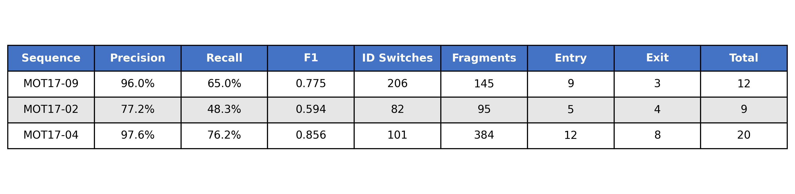

# mot17-tracking-and-counting

MOT17 veri seti üzerinde YOLOv8 + ByteTrack kullanarak kişi takibi ve sayımı

## Teknik Yaklaşım

- **Detection:** YOLOv8n (nano model)
- **Tracking:** ByteTrack (Kalman Filter + Hungarian Algorithm)
- **Counting:** Çizgi kesişimi
- **Metrikler:** Detection (Precision/Recall/F1), Tracking (ID switches, fragmentations)

## Kurulum

```bash
git clone https://github.com/ozermehmett/mot17-tracking-and-counting.git

cd mot17-tracking-and-counting

python3 -m venv venv
source venv/bin/activate # for linux
pip install -r requirements.txt
```

## Veri Seti

MOT17 verisinden 3 sequence kullanıldı:
- **MOT17-09:** AVM sahnesi
- **MOT17-02:** Cadde sahnesi
- **MOT17-04:** Gece cadde sahnesi

### Veri indirme

```bash
wget https://motchallenge.net/data/MOT17.zip
unzip -q MOT17.zip -d data/
```

Klasör yapısı:

```bash
data/MOT17/train/
  ├── MOT17-02-SDP/
  ├── MOT17-04-SDP/
  └── MOT17-09-SDP/
```

## Kullanım

```bash
python run.py --sequence MOT17-09
python run.py --sequence MOT17-02
python run.py --sequence MOT17-04
```

## Ayarlar

`configs/` klasöründeki ayarlar:
- **counting_lines.yaml:** Çizgi konumları
- **model.yaml:** YOLOv8 parametreleri (conf: 0.35)
- **tracker.yaml:** ByteTrack parametreleri (buffer: 100)
- **sequences.yaml:** MOT17 sequence bilgileri

## Sayma için Çizgi Ayarları

`configs/counting_lines.yaml` içinde tanımlı:

- **MOT17-09:** Dikey çizgi (x=1200)
- **MOT17-02:** Dikey çizgi (x=1300)
- **MOT17-04:** Yatay çizgi (y=840)

## Çıktılar

```
outputs/<SEQUENCE>/
├── output.mp4           # İşlenmiş video (track ID + çizgi)
├── tracking.txt         # MOT format track çıktısı
├── results.json         # Giriş/çıkış sayımları
├── events.csv           # Tüm crossing eventleri
└── evaluation.json      # Detection/tracking metrikleri

outputs/
└── results_table.png    # Tüm sequencelerin metrik tablosu
```

### Örnek events.csv
```csv
frame,track_id,event_type,direction
104,20,entry,right
138,9,exit,left
216,81,entry,right
```

## Sonuçlar



## Demo

### MOT17-04 (F1: 0.856)


### MOT17-09 (F1: 0.775)


### MOT17-02 (F1: 0.594)


## Proje Yapısı

```
.
├── configs
│   ├── counting_lines.yaml
│   ├── model.yaml
│   ├── sequences.yaml
│   └── tracker.yaml
├── data
│   └── MOT17
│       └── train
│           ├── MOT17-02-SDP
│           ├── MOT17-04-SDP
│           └── MOT17-09-SDP
├── outputs
│   ├── MOT17-02
│   ├── MOT17-04
│   └── MOT17-09
├── README.md
├── requirements.txt
├── run.py
├── scripts
│   ├── evaluate.py
│   └── generate_results_table.py
├── src
│   ├── core
│   │   ├── counter.py
│   │   ├── detector.py
│   │   ├── __init__.py
│   │   └── tracker.py
│   ├── __init__.py
│   └── utils
│       ├── geometry.py
│       ├── video_io.py
│       └── visualization.py
└── yolov8n.pt
```

## Gereksinimler

- OpenCV
- Ultralytics YOLOv8
- NumPy, SciPy, PyYAML
